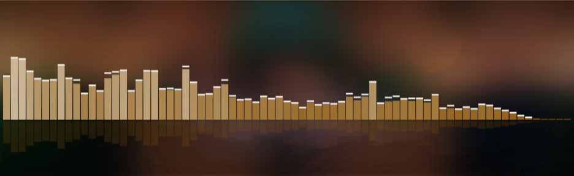
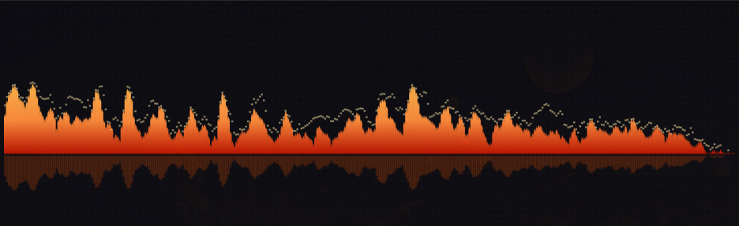
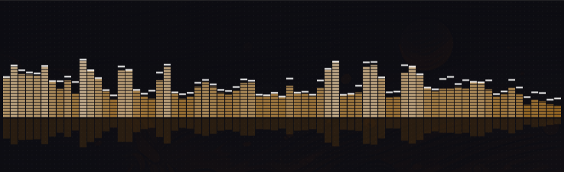
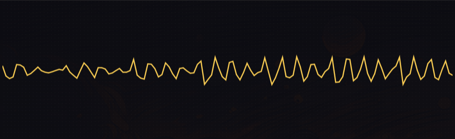
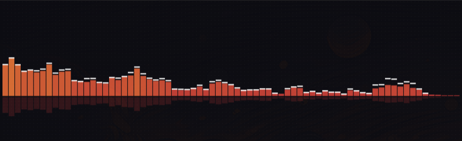
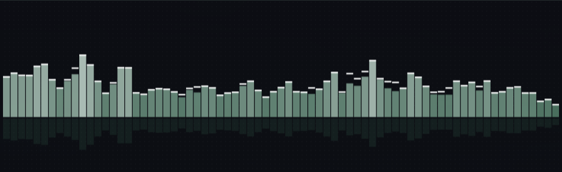
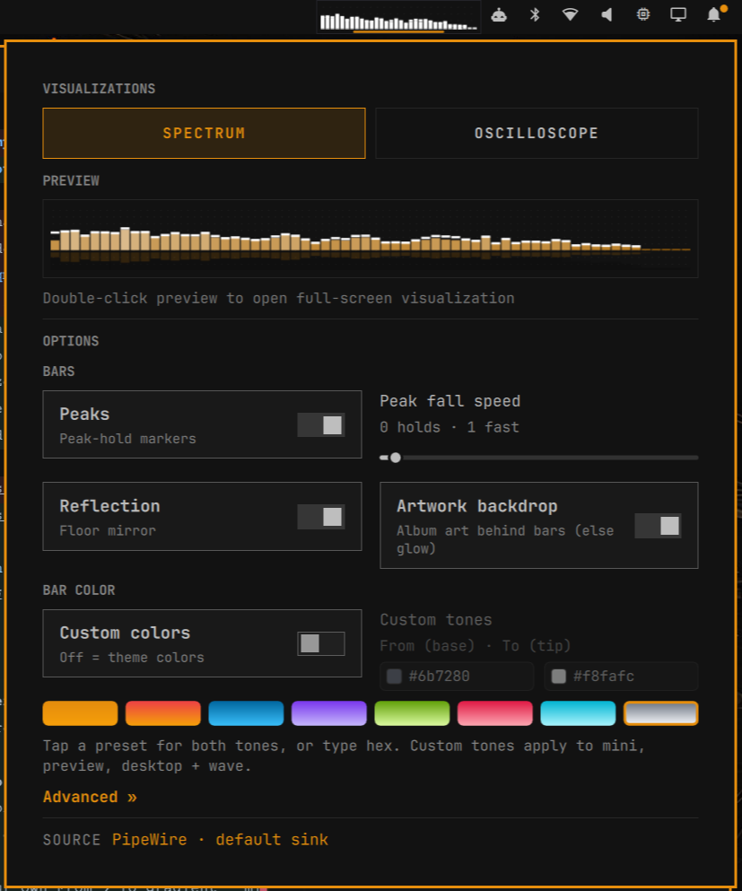

# omaviz — if you liked Winamp, you'll love omaviz even more

The spectrum analyzer you stared at for hours in 1999 — reborn as a
native citizen of your Linux desktop. Live bars in your bar, a full
desktop visualizer window, and an oscilloscope that dances to whatever
is playing. Same soul, zero nostalgia tax: buttery Canvas rendering,
theme-aware, and configured with two clicks.

 

## Why omaviz

- **It lives where you look.** No separate app to open — the visualizer
  is always there, in the bar, pulsing with your music, your calls,
  your game.
- **One click to tweak, double-click to go big.** The settings panel
  shows a live preview of every change. Double-click it and the same
  visualization explodes onto a borderless desktop window.
- **Your colors, everywhere.** Follow the Omarchy theme automatically,
  or dial in your own From → To gradient — mini, preview, desktop and
  waveform all stay in sync.
- **Winamp physics, not a slideshow.** Peak-hold markers with accelerating
  fall, instant-rise linear mode, flame gradients, segmented stacks —
  the motion language your muscle memory already knows.

## The tour

| | |
|---|---|
|  |  |
| *Desktop window + artwork backdrop + floor reflection* | *Fire: red base igniting into your custom tip* |
|  |  |
| *Stacks: segmented Winamp-style bars* | *Oscilloscope: true time-domain waveform* |
|  |  |
| *Bar color: presets or your own From → To tones* | *Theme mode tracks the Omarchy accent live* |

## Features

- **Mini** — 32 bars in the bar (128-band engine feed, max-downsampled),
  with a dotted-skin backdrop and a B&W Mono mode for tiny sizes
- **Spectrum** — peaks + fall speed, dense Spikes, Fire flame gradient,
  Winamp Stacks, floor-mirror Reflection, album-art backdrop
- **Oscilloscope** — true 128-point time-domain waveform, adjustable
  thickness, follows your colors
- **Bar color** — theme-dominant by default (tracks Omarchy theme
  switches live), or custom From → To tones via presets or hex
- **Motion** — exponential easing by default, Winamp-style linear fall
  on demand, adjustable sensitivity
- **Robust** — shared-flag + heartbeat desktop lifecycle (no zombies),
  engine auto-retry, one shared Canvas renderer everywhere
  (GPU path planned next — see `GPU_PLAN.md`)

## Install

```bash
cd ~/workspace/omaviz
./install.sh            # zero-build: uses the committed engine binary
./install.sh --build    # rebuild engine from Rust source first
./uninstall.sh          # remove plugin (+ launcher); --purge also config
```

Requires: Omarchy (quickshell), PipeWire, `cargo` (only for `--build`).

Single-click the mini for settings · double-click (or `SUPER+V`) for the
desktop window · close it and the mini returns by itself.

## Engine

```bash
omaviz-engine --bands 128 --fall-mode exp|linear --fft-size 2048 --wave
```

One JSON frame per line on stdout (`bands, energy, beat, silent, source,
t`) plus `{wave:[...]}` lines with `--wave`. Emits on fresh audio with a
5Hz heartbeat; explicit zero-silence 2s after capture death.

## Layout

```
plugin/          # self-contained drop-in → ~/.config/omarchy/plugins/org.omaviz.visualizer/
  BarWidget.qml  # bar mini + engine spawn + all config writes
  Panel.qml      # settings panel (preview + options)
  Desktop.qml    # detached window (standalone quickshell -p, NO qs.* imports)
  VisualCanvas.qml  # THE shared renderer (all modes, all options)
  GpuCanvas.qml + gpu.frag  # GPU path (roadmap: GPU_PLAN.md — Canvas is the verified renderer)
  Model.js       # config parse/write, spectrum parsing
  tests/         # node tests (config, migration, keys)
engine/          # Rust: PipeWire capture → FFT → bands + wave frames
install.sh / build.sh / uninstall.sh
APP_SPEC.md  # full spec · GPU_PLAN.md  # GPU renderer roadmap (next version)
```

## Docs

- `APP_SPEC.md` — architecture, config keys, lifecycle
- `GPU_PLAN.md` — GPU renderer roadmap (next version)
- `AGENTS.md` — rules for AI agents working in this repo

## Mini

Thirty-two live bars riding in your bar, fed by the 128-band engine —
with a dotted-skin backdrop and a B&W Mono mode for tiny sizes.
Single-click the mini for the settings panel below, double-click it
(or `SUPER+V`) for the desktop window:


