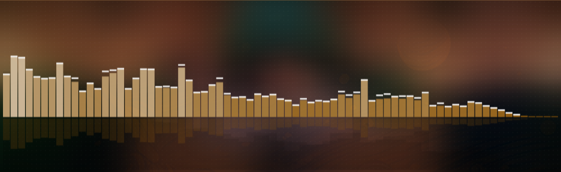
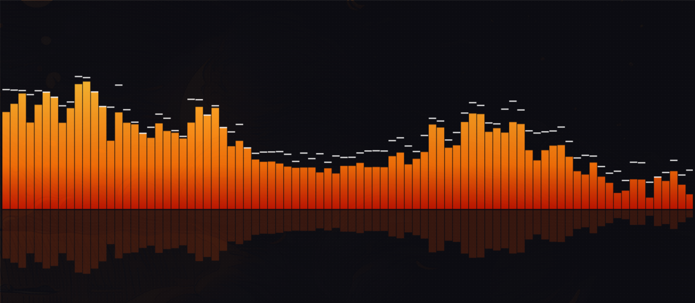
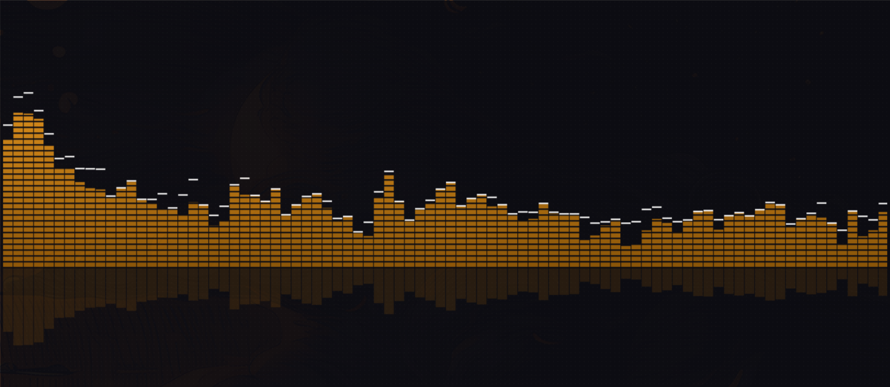
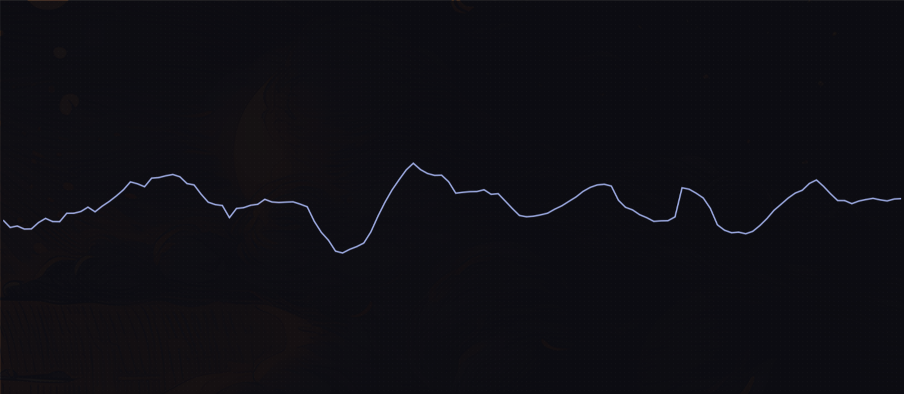
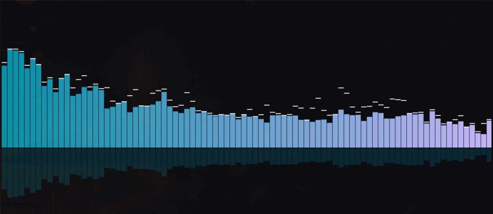
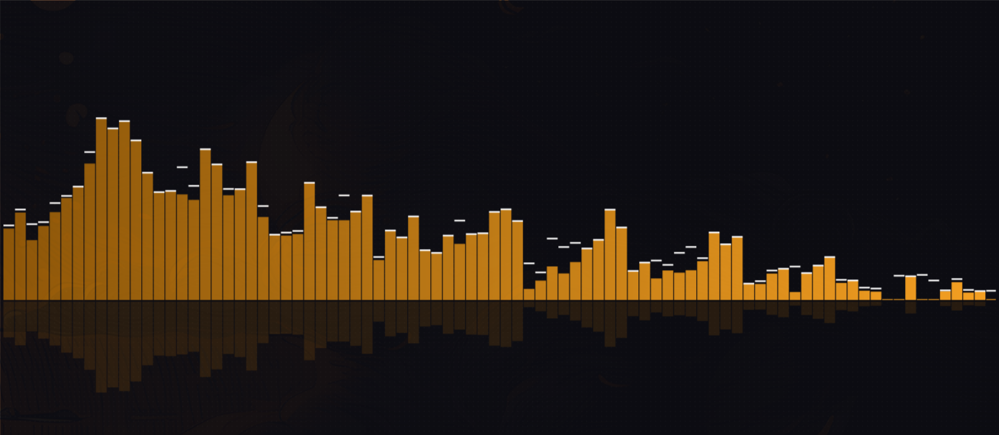

# omaviz — if you liked Winamp, you'll love omaviz even more

The spectrum analyzer you stared at for hours in 1999 — reborn as a
native citizen of your Omarchy desktop. Live bars in your waybar, a full
desktop visualizer window, and an oscilloscope that dances to whatever
is playing. Same soul, zero nostalgia tax: buttery Canvas rendering,
theme-aware, and configured with two clicks.

 

## Why omaviz

- **It lives where you look.** No separate app to open — the visualizer
  is always there, in the bar, pulsing with your music, your calls,
  your game.
- **One click to tweak, one more to go big.** The settings panel
  shows a live preview of every change — click that preview and the same
  visualization explodes onto a borderless desktop window.
- **Your colors, everywhere.** Follow the Omarchy theme automatically,
  or dial in your own From → To gradient — mini, preview, desktop and
  waveform all stay in sync.
- **Deaf to players, loyal to sound.** It listens at the PipeWire monitor,
  so it visualizes *everything* — Spotify, browser, games, calls, local
  files. No player plugins, no per-app setup, no exceptions.
- **Winamp physics, not a slideshow.** Peak-hold markers with accelerating
  fall, instant-rise linear mode, flame gradients, segmented stacks —
  the motion language your muscle memory already knows.

## The tour

| | |
|---|---|
|  |  |
| *Desktop window + artwork backdrop + floor reflection* | *Fire: red base igniting into your custom tip* |
|  |  |
| *Stacks: segmented Winamp-style bars* | *Oscilloscope: true time-domain waveform* |
|  |  |
| *Bar color: presets or your own From → To tones* | *Theme mode tracks the Omarchy accent live* |

## Features

- **Mini** — 32 bars in the bar (128-band engine feed, max-downsampled),
  with a dotted-skin backdrop and a B&W Mono mode for tiny sizes
- **Spectrum** — peaks + fall speed, dense Spikes, Fire flame gradient,
  Winamp Stacks, floor-mirror Reflection, album-art backdrop
- **Oscilloscope** — true 128-point time-domain waveform, adjustable
  thickness, follows your colors
- **Bar color** — theme-dominant by default (tracks Omarchy theme
  switches live), or custom From → To tones via presets or hex
- **Motion** — exponential easing by default, Winamp-style linear fall
  on demand, adjustable sensitivity
- **Robust** — shared-flag + heartbeat desktop lifecycle (no zombies),
  engine auto-retry, one shared Canvas renderer everywhere.

## Install

Requires Omarchy (Quickshell) + PipeWire. **Nothing has to be built or run by
hand** — the engine binary ships committed, and Omarchy installs the plugin as
a self-contained folder.

### From the plugin marketplace (recommended)

Install from the Omarchy plugin marketplace, or equivalently:

```bash
omarchy plugin add https://github.com/omaviz/omaviz --enable
```

That is the entire install. `omarchy plugin add` clones this repository,
validates it, and moves the folder into
`~/.config/omarchy/plugins/org.omaviz.visualizer/` — **no script from this
repository is executed, and there is nothing to run afterwards.** The engine
ships as a committed executable at `bin/omaviz-engine` (git mode `100755`, so
the exec bit survives the clone), and the bar widget spawns it from that path
as soon as it mounts.

Removing it is the standard manager operation — its own tool, not ours:

```bash
omarchy plugin remove org.omaviz.visualizer
```

There is no `manual-setup` step. If you ever see no bars, check
`omarchy plugin list` shows the plugin enabled.

### Local development / manual clone

`install.sh` is a convenience for working on omaviz from a git checkout. It is
**not** part of the marketplace install path and never runs during one.

```bash
./install.sh            # copy into the plugin dir, enable, restart the shell
./install.sh --build    # same, but rebuild the engine from Rust source first
./uninstall.sh          # remove the plugin (+ launcher); --purge also config
```

Both scripts are ownership-guarded: they never delete or replace files omaviz
does not own, and uninstall removes only what this plugin installed
(`tests/installer.test.sh` proves it).

Requires: Omarchy (quickshell), PipeWire. `cargo` is needed only for `--build`.

## Testing

```bash
npm test              # all JS/QML suites (node >= 24)
npm run test:rust     # engine unit tests (cargo)
npm run verify        # both
```

| Suite | What it proves |
| --- | --- |
| `tests/modelstore.test.cjs` | config defaults/schema, TOML round-trips, the store funnel (get/set/onChanged) |
| `tests/physics.test.cjs` | the shared motion model: instant attack, rate-limited release, peak sustain + accelerating fall |
| `tests/qml.test.cjs` | real `qmllint` syntax check, duplicate-property guard, cross-surface invariants |
| `tests/engine.test.cjs` | drives the committed binary and asserts its frame contract (60 Hz, raw bands, faint-signal handling) |
| `engine/` (cargo) | DSP + frame + source unit tests |

**Safety:** the installer never deletes files it doesn't own. A plugin
directory that isn't omaviz-managed (no `.omaviz-managed` marker) is left
untouched unless you pass `--force` (which takes a timestamped backup
first). Foreign files inside a managed install — and unrelated
`.desktop` launchers — always survive install, update, and uninstall.

Single-click the mini for settings · single-click the preview inside it to
detach the desktop window · close it and the mini returns by itself.

## Mini

Thirty-two live bars riding in your bar, fed by the 128-band engine —
with a dotted-skin backdrop and a B&W Mono mode for tiny sizes.
Single-click the mini for the settings panel below; single-click the live
preview inside it to detach the desktop window:


## Engine

The Rust engine lives *inside* the plugin and is fully managed —
spawned, restarted and retired by the bar widget itself. There is
nothing to configure, no service to enable, no socket to babysit:
install and it just runs. Rebuild from source only if you want to
hack on it (`./install.sh --build`).

```bash
omaviz-engine --bands 128 --fft-size 2048 --wave
```

One JSON frame per line on stdout (`bands, energy, beat, silent, source,
t`) plus `{wave:[...]}` lines with `--wave`. Emits on fresh audio with a
5Hz heartbeat; explicit zero-silence 2s after capture death.

## Layout

Repo root **is** the plugin (`manifest.json` lives here, per the
marketplace rules) — dev-only baggage (`engine/`, `docs/`, scripts)
is excluded at install time:

```
manifest.json    # plugin identity (id, version, entry points)
BarWidget.qml    # bar mini + engine spawn + all config writes
Panel.qml        # settings panel (preview + options)
Desktop.qml      # detached window (standalone quickshell -p, NO qs.* imports)
VisualCanvas.qml # THE shared renderer (all modes, all options)
ModelStore.js    # config store: parse/write, defaults, reactive get/set, spectrum parse
Physics.js       # shared bar/peak motion model (unit-tested)
assets/ bin/ tests/  # launcher entry, COMMITTED engine binary, node tests
engine/          # Rust source: PipeWire capture → FFT → bands + wave frames
install.sh / build.sh / uninstall.sh
APP_SPEC.md  # full spec
```

Installs to `~/.config/omarchy/plugins/org.omaviz.visualizer/`.

## Docs

- `APP_SPEC.md` — architecture, config keys, lifecycle
- `docs/AGENTS.md` — rules for AI agents working in this repo

## Open source

> **Private by design.** No trackers, no analytics, no network calls —
> the engine reads your local audio, the panel reads local players, and
> nothing ever leaves your machine.

MIT-licensed and hackable end to end: QML surfaces, shared Canvas
renderer and the Rust PipeWire engine all live in this repo, with
`APP_SPEC.md` as the design record and tests for both sides
(`tests`, `cargo test`). Found a rough edge or a missing
Winamp-ism? Issues and PRs welcome — the tour screenshots above are
all taken from the live plugin, so what you see is what runs.
