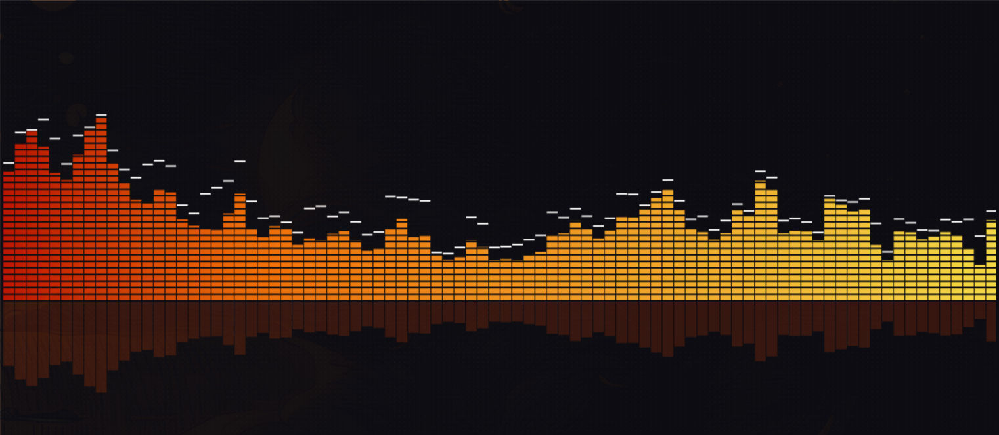
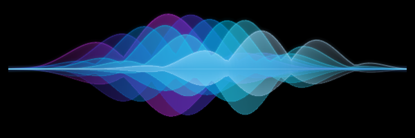
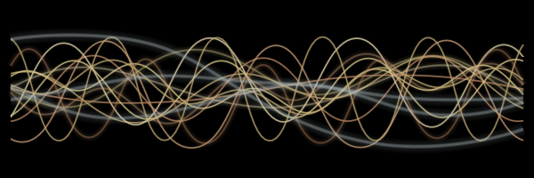
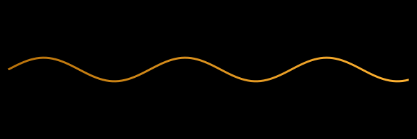
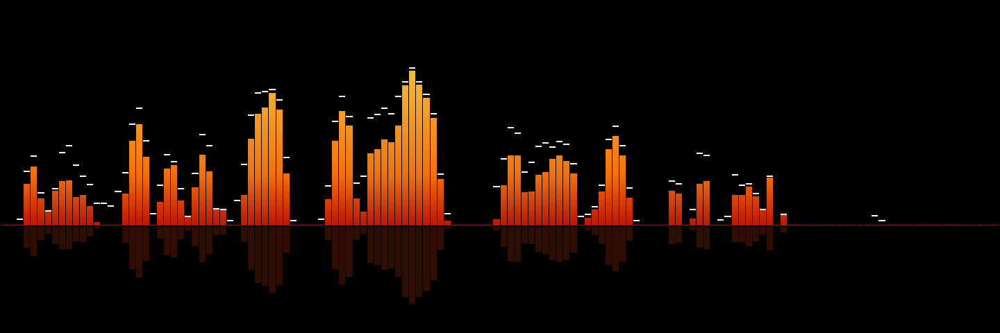
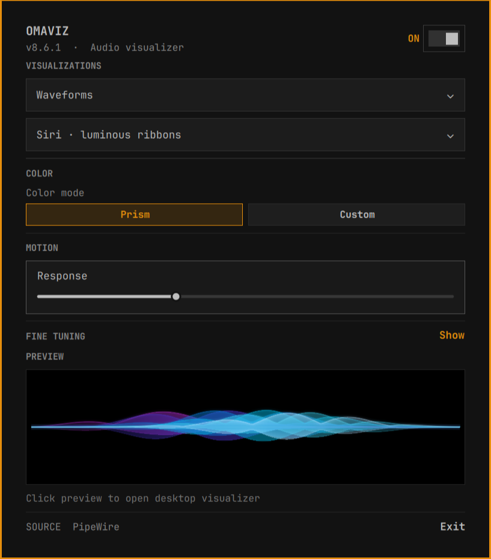
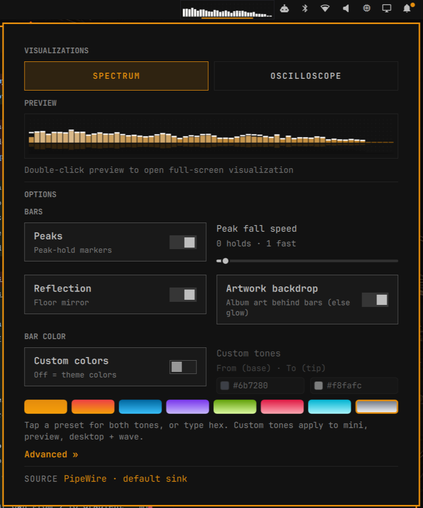

# omaviz — if you liked Winamp, you'll love omaviz even more

The spectrum analyzer you stared at for hours in 1999 — reborn as a
native citizen of your Omarchy desktop. Live bars in your waybar, a full
desktop visualizer window, and an oscilloscope that dances to whatever
is playing. Same soul, zero nostalgia tax: native GPU rendering,
theme-aware, and configured with two clicks.

 

## Why omaviz

- **It lives where you look.** No separate app to open — the visualizer
  is always there, in the bar, pulsing with your music, your calls,
  your game.
- **One click to tweak, one more to go big.** The settings panel
  shows a live preview of every change — click that preview and the same
  visualization explodes onto a borderless desktop window.
- **Your colors, everywhere.** Follow the Omarchy theme automatically,
  or dial in your own From → To gradient — mini, preview, desktop and
  waveform all stay in sync.
- **Deaf to players, loyal to sound.** It listens at the PipeWire monitor,
  so it visualizes *everything* — Spotify, browser, games, calls, local
  files. No player plugins, no per-app setup, no exceptions.
- **Winamp physics, not a slideshow.** Peak-hold markers with accelerating
  fall, instant-rise linear mode, flame gradients, segmented stacks —
  the motion language your muscle memory already knows.

## The tour



The fire spectrum hero is captured from the native desktop renderer driven by live
PipeWire audio, with reflection and peaks enabled and Response at 2.2×. Waveform
examples use controlled audio to show their shapes; the settings screenshot is
from the running Omarchy panel. Images retain their original proportions.

| | |
|---|---|
|  |  |
| *Siri: luminous, layered ribbons* | *Strings: vibrating strands with depth* |
|  |  |
| *Waves: the audio signal as an oscilloscope* | *Live fire spectrum: reflection and Winamp-style peaks* |

<details>
<summary>Settings panel (v8.6.1)</summary>



</details>

## Features

- **Mini** — 32 bars in the bar (128-band engine feed, max-downsampled),
  with a dotted-skin backdrop and a B&W Mono mode for tiny sizes
- **Spectrum** — peaks + fall speed, dense Spikes, Fire flame gradient,
  Winamp Stacks, floor-mirror Reflection, album-art backdrop.
  The experimental retained renderer is enabled in this build (`OMAVIZ_SPECTRUM_RETAINED=0` disables it);
  it preserves peak physics and 60 Hz animation, but has not met the 50% performance target.
- **Waves** — true 128-point time-domain waveform, adjustable
  thickness, follows your colors
- **Bar color** — theme-dominant by default (tracks Omarchy theme
  switches live), or custom From → To tones via presets or hex
- **Strings** — crossing gold, cream and softly blurred blue strands that vibrate around fixed positions like standing waves. Spectral bands pluck individual strands; waveform samples add local motion. Small surfaces use fewer strands to retain separation. The backdrop stays transparent.
  A retained GPU mesh preserves the existing curves and glow; the feed carries the 16 strand excitation values plus the full waveform.
- **Siri** — the existing cyan/blue/violet ribbons remain the default. Enable **Classic Siri style**, beside **Left to right motion**, for independently appearing, mirrored color lobes on a fine neutral axis, based on the classic Siri reference. Red, green, blue, and cyan overlaps brighten toward white; custom palettes and monochrome remain supported.
  Six spectral envelopes control the response without a shared minimum height. Lobes have separate lifetimes, widths, and prominence, and disappear into the baseline during pauses. Their shape stays in GPU memory at 60 Hz. Enable **Left to right motion** under **Motion** to add sideways travel; default motion expands and contracts in place.
- **Motion** — Winamp-style linear fall by default, optional exponential easing,
  adjustable sensitivity
- **Robust** — desktop lease stored separately from settings (no heartbeat overwrites),
  engine auto-retry, one shared GPU renderer everywhere.

## Install

Requires Omarchy (Quickshell), Qt 6.11 or newer, an accelerated Qt Quick backend, and PipeWire. The bundled native renderer targets Linux x86_64. **Nothing has to be built or run by
hand** — the engine binary ships committed, and Omarchy installs the plugin as
a self-contained folder.

### From the plugin marketplace (recommended)

Install from the Omarchy plugin marketplace, or equivalently:

```bash
omarchy plugin add https://github.com/omaviz/omaviz --enable
```

The original marketplace issue uses **Widgets** with `bar`, `media`, and
`quickshell` tags; the manifest's **Audio** category is Omarchy's separate
bar-widget field. The current listing is already published. For later merges,
the Marketplace preflight workflow validates local submission inputs and
attaches an exact-commit update form for review. Run
`MARKETPLACE_COMMIT="$(git rev-parse origin/master)" node tools/marketplace-update.cjs`
for its body and add `--title` for its title. Each new upstream commit still
needs the marketplace's own validation,
security baseline, and maintainer decision; local CI cannot grant approval.

That is the entire install. `omarchy plugin add` clones this repository,
validates it, and moves the folder into
`~/.config/omarchy/plugins/org.omaviz.visualizer/` — **no script from this
repository is executed, and there is nothing to run afterwards.** The engine
ships as a committed executable at `bin/omaviz-engine` (git mode `100755`, so
the exec bit survives the clone), and the bar widget spawns it from that path
as soon as it mounts.

Removing it is the standard manager operation — its own tool, not ours:

```bash
omarchy plugin remove org.omaviz.visualizer
```

There is no `manual-setup` step. If you ever see no bars, check
`omarchy plugin list` shows the plugin enabled.

### Local development / manual clone

`install.sh` is a convenience for working on omaviz from a git checkout. It is
**not** part of the marketplace install path and never runs during one.

```bash
./install.sh            # copy into the plugin dir, enable, restart the shell
./install.sh --build    # same, but rebuild the engine from Rust source first
./uninstall.sh          # remove the plugin (+ launcher); --purge also config
```

Both scripts are ownership-guarded: they never delete or replace files omaviz
does not own, and uninstall removes only what this plugin installed
(`tests/installer.test.sh` proves it).

Requires: Omarchy (quickshell), Qt 6.11+, PipeWire. Maintainer builds use Cargo, CMake, a C++17 compiler, Qt Quick development files and Qt Shader Tools. `./build.sh` builds both the Rust engine and the native renderer; users receive both binaries.

## Testing

```bash
npm test              # all JS/QML suites (node >= 24)
npm run test:rust     # engine unit tests (cargo)
npm run verify        # JS, installer safety, and Rust
```

| Suite | What it proves |
| --- | --- |
| `tests/modelstore.test.cjs` | config defaults/schema, TOML round-trips, the store funnel (get/set/onChanged) |
| `tests/physics.test.cjs` | the shared motion model: instant attack, rate-limited release, peak sustain + accelerating fall |
| `tests/qml.test.cjs` | real `qmllint` syntax check, duplicate-property guard, cross-surface invariants |
| `tests/engine.test.cjs` | drives the committed binary and asserts its frame contract (60 Hz, raw bands, faint-signal handling) |
| `engine/` (cargo) | DSP + frame + source unit tests |

**Safety:** the installer never deletes files it doesn't own. A plugin
directory that isn't omaviz-managed (no `.omaviz-managed` marker) is left
untouched unless you pass `--force` (which takes a timestamped backup
first). Foreign files inside a managed install — and unrelated
`.desktop` launchers — always survive install, update, and uninstall.

Single-click the mini for settings · single-click the preview inside it to
detach the desktop window · close it and the mini returns by itself.

## Mini

Thirty-two live bars riding in your bar, fed by the 128-band engine —
with a dotted-skin backdrop and a B&W Mono mode for tiny sizes.
Single-click the mini for the settings panel below; single-click the live
preview inside it to detach the desktop window:



## Engine

The Rust engine lives *inside* the plugin and is fully managed —
spawned, restarted and retired by the bar widget itself. There is
nothing to configure, no service to enable, no socket to babysit:
install and it just runs. Rebuild from source only if you want to
hack on it (`./install.sh --build`).

```bash
omaviz-engine --bands 128 --fft-size 2048 --wave
```

One JSON frame per line on stdout (`bands, energy, beat, silent, source,
t`) plus `{wave:[...]}` lines with `--wave`. Emits on fresh audio with a
5Hz heartbeat; explicit zero-silence 2s after capture death.

## Layout

Repo root **is** the plugin (`manifest.json` lives here, per the
marketplace rules) — dev-only baggage (`engine/`, `docs/`, scripts)
is excluded at install time:

```
manifest.json    # plugin identity (id, version, entry points)
BarWidget.qml    # bar mini + engine spawn + all config writes
Panel.qml        # settings panel (preview + options)
Desktop.qml      # detached window (standalone quickshell -p, NO qs.* imports)
VisualCanvas.qml # shared display clock, physics and rendering API
renderer/        # native batched Qt Quick geometry source
native/          # bundled QML plugin (all modes, all surfaces)
ModelStore.js    # config store: parse/write, defaults, reactive get/set, spectrum parse
Physics.js       # shared bar/peak motion model (unit-tested)
assets/ bin/ tests/  # launcher entry, COMMITTED engine binary, node tests
engine/          # Rust source: PipeWire capture → FFT → bands + wave frames
install.sh / build.sh / uninstall.sh
APP_SPEC.md  # full spec
```

Installs to `~/.config/omarchy/plugins/org.omaviz.visualizer/`.

## Docs

- `APP_SPEC.md` — architecture, config keys, lifecycle
- `docs/AGENTS.md` — rules for AI agents working in this repo

## Open source

> **Private by design.** No trackers, no analytics, no network calls —
> the engine reads your local audio, the panel reads local players, and
> nothing ever leaves your machine.

MIT-licensed and hackable end to end: QML surfaces, shared GPU
renderer and the Rust PipeWire engine all live in this repo, with
`APP_SPEC.md` as the design record and tests for both sides
(`tests`, `cargo test`). Found a rough edge or a missing
Winamp-ism? Issues and PRs welcome — the tour screenshots above are
all taken from the live plugin, so what you see is what runs.

Settings saves are serialized so rapid selections remain applied. Flame has independent
`fire_color_from` / `fire_color_to` colors; changing custom swatches preserves them.
Desktop liveness lives in `desktop-state.toml` alongside `config.toml`.

GPU migration acceptance and CPU/GPU budgets are tracked in [GPU_PLAN.md](GPU_PLAN.md). Resource targets require live measurements; passing unit tests alone does not establish them.

### Minimal settings and playback controls

Choose Spectrum or Waveforms from the top dropdown. Waveforms offers Waves (the oscilloscope),
Strings, and Siri in a second dropdown. Only relevant controls appear.
Fine tuning starts collapsed. The larger live preview sits at the bottom on
a pure black background. Custom colors support editable start/end hex values
and an optional middle color across mini, preview, and desktop; presets return
to two colors. The Peacock preset adds teal, violet, and gold; Strings supports
the same custom colors. Spectrum’s Artwork mode extracts cover colors for both
the bars and the desktop’s blurred, tinted background, with theme colors as a
fallback when artwork is unavailable. The desktop hover card shows artwork and track details, with
play/pause when the active media player supports it.

Off pauses visualization and capture while keeping the plugin and desktop controls
available. On resumes in place. Exit closes the desktop, stops Omaviz capture,
and unloads the plugin from the shared shell. Desktop settings apply on completed
file loads, with a 250ms polling fallback. Hover controls remain stable while
pointing at buttons, and the controlled media player stays selected after Pause.

Native visual regression: after building with `OMAVIZ_RENDER_PROBE=ON`, run
`tests/renderer-visual.sh /path/to/omaviz-render-probe` in a graphical session.
Each mode or transition probe closes after three seconds and checks visible color
coverage, including Spectrum receiving its first bands after startup. Screenshots
are kept in the reported temporary directory for visual review.

Keyboard controls: use Tab to reach settings, Space/Enter to activate choices,
and arrow keys or Home/End to adjust sliders. Focused settings scroll into view.
In the desktop visualizer, Tab reveals playback/close controls; they remain
visible while focused. The desktop minimum size is 320×160 to keep actions usable.

Run `npm run test:interactions` on an Omarchy development machine for Qt mouse
and keyboard regression tests. The tests extract current controls from the QML;
shell theme decoration and the media player are isolated fixtures.

Desktop waveform resizing preserves a centered 3:1 drawing area for Waves, Strings,
and Siri, fitting within wide or tall windows without stretching the shapes.
Spectrum fills the available window with width-dependent bar density.
